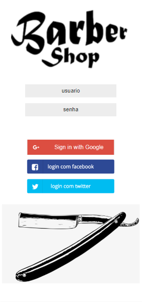
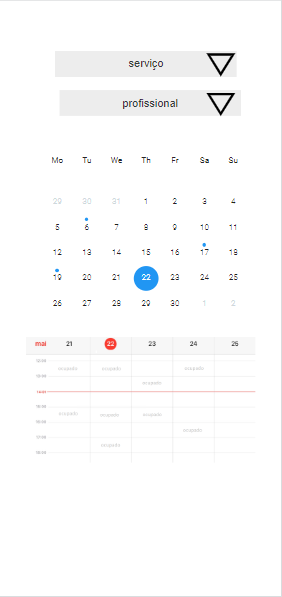
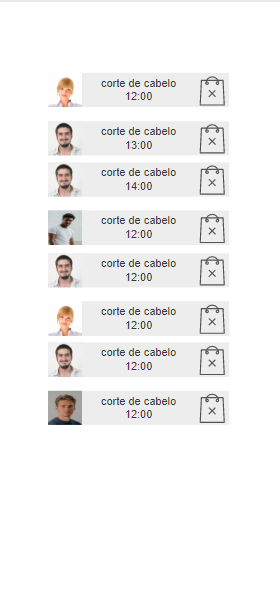
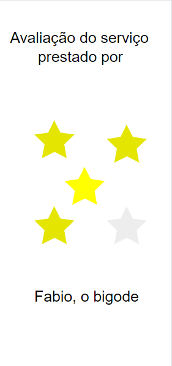

  
## Reunião #1 com o cliente 2020-mar-07

  Estes são os rabiscos da reunião com o João, O Bigodudo para a criação de um sistema para ele.

  João contou que o <strong>problema</strong> identificado por ele é que os clientes estão se acumulando do lado de fora da barbearia, formando fila, o que faz com que muitos desistam do atendimento. Ele perguntou se conheço alguma solução para ajudá-lo. Como os salões fazem? O que os concorrentes têm que ele ainda não sabe?

  <strong>Sugeri a ideia de criar uma agenda</strong>, em forma de aplicativo, para que cada cliente tenha seu próprio horário e cheguem somente no tempo correto, evitando assim filas e desistências.

  O João gostou da ideia e conversamos sobre <strong>algumas funcionalidades básicas</strong> que o aplicativo teria.

  1. autenticação, precisamos que o cliente que marcou o horário seja ele mesmo;
  2. agenda, cada cliente poderá marcar seu próprio horário, e poderá cancela-lo também;
  3. avaliação, cada cliente avaliará o serviço prestado;
  4. notificação, o cliente receberá um aviso de que seu horário está próximo;

  João me perguntou sobre o preço para o desenvolvimento e se eu poderia entrega-lo na próxima semana, dia 14. Respondi que não pois ainda <strong>precisamos refinar esses requisitos e melhorar o entendimento das necessidades</strong> dele. <strong>Deixei claro que se ele lembrasse de mais alguma</strong> coisa poderia me ligar ou mandar um e-mail.

  Dei o nome "Barba-e-ria" para o projeto. Achei engraçado.

  
## Reunião #2 com o cliente 2020-mar-14

Estes são os rabiscos da segunda reunião com o João, O Bigodudo para a criação de um sistema para ele.

Esse foi uma semana bem agitada, João me ligou várias vezes dizendo que estamos subestimando o aplicativo e pediu mais funcionalidades (adeus sistema simples, fácil e rápido).

Hoje voltei a falar com ele para apresentar a <strong>lista de requisitos</strong> identificados, e já <strong>classificados (entre funcional e não funcional)</strong>, e saber se está de acordo com o que ele tem em mente. A lista dos requisitos são:

  1. RF01 - alto - essencial - marcar horário, cada cliente poderá marcar seu próprio horário escolhendo em um calendário o horário livre. Saberemos a janela necessária pois os serviços prestados pela barbearia já estarão pre-cadastrados e os barbeiros também;
  2. RF02 - médio - importante - cancelar horário, tanto o cliente quanto o barbeiro escolhido podem cancelar um horário quando quiserem, sem restrição.
  3. RF03 - médio - importante - avaliar serviço, cada cliente avaliará o serviço prestado;
  4. RF06 - baixo - desejável - notificar agendamento, o cliente receberá um aviso, pelo aplicativo, de que seu horário está próximo;
  5. RF04 - médio - importante - verificar histórico, o cliente ou o barbeiro poderão ver todos os agendamentos passados ou futuros dele;
  6. RF05 - baixo - desejável - salvar perfil, o cliente poderá atualizar suas informações no aplicativo.
  7. RNF03 - alto - essencial - plataforma, o aplicativo deve funcionar em IOS e Android;
  8. RNF04 - médio - essencial - layout, deve seguir a identidade da barbearia;
  9. RNF01 - alto - importante - autenticar usuário, precisamos que o cliente que marcou o horário seja ele mesmo. Não deve ser armazenado login e senha;
  
  Após apresentar a lista de requisitos, João concordou com essa lista e concluímos <strong>o escopo</strong> do sistema. Estamos prontos para prosseguir e pedi para o João classificar a prioridade desses requisitos e qual <strong>a importância</strong> de cada um deles.

## Preparação para a reunião #3 (parte 1/3) - prototipo - 2020-mar-21

Como os requisitos foram levantados corretamente (até o momento), comecei a fazer um protótipo de baixa fidelidade (para não ocupar muito meu tempo).
O protótipo foi realizado com uma ferramenta online, apenas para que o cliente tenha uma ideia das principais funcionalidades do aplicativo (aqueles marcados como essenciais ou importantes). Assim, teremos aumentaremos a certeza sobre os principais pontos do sistema.

<table>
  <tr>
    <td></td>
    <td></td>
  </tr>
  <tr>
    <td>Tela de Login</td>
    <td>Tela de Agendamento</td>
  </tr>  
  <tr>
    <td></td>
    <td></td>
  </tr>
  <tr>
    <td>Tela de Agenda do Barbeiro</td>
    <td>Tela de avaliação</td>
  </tr> 
  </table>
  
  Embora o cliente não tenha solicitado login por Facebook, Google ou Twitter... acredito que será uma boa surpresa.
